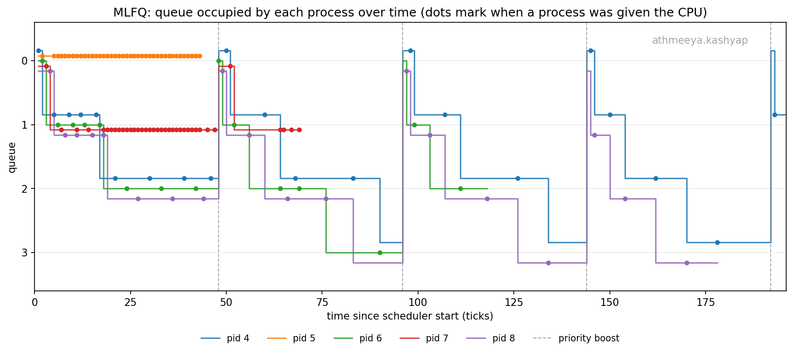
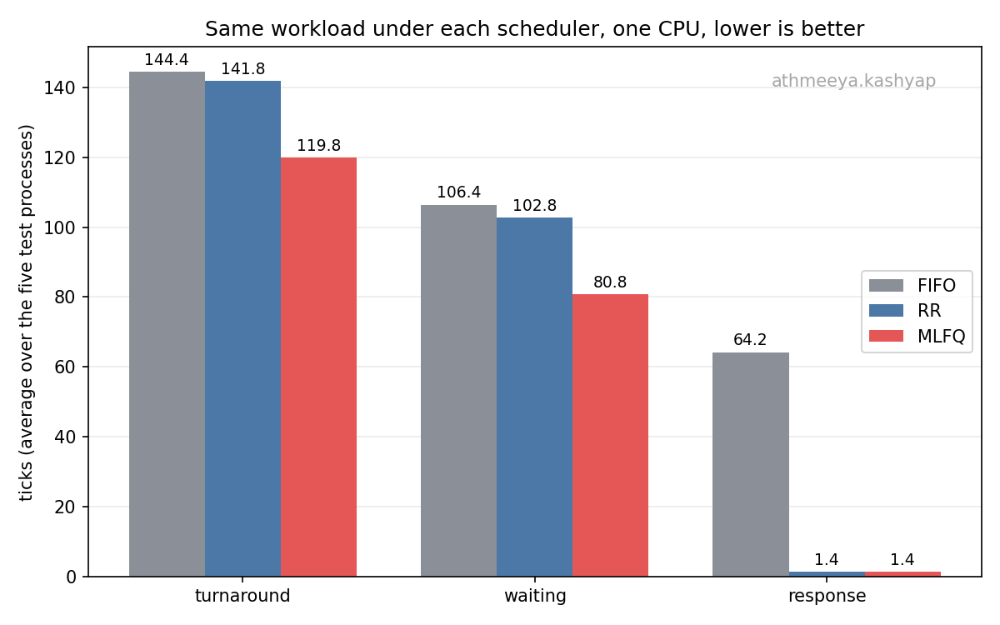

# xv6: a multi level feedback queue scheduler

**Name:** Athmeeya M Kashyap
**Roll number:** 2024113015

## Building

The scheduling policy is chosen when the kernel is compiled.

```
make clean; make qemu                  # round robin, the original scheduler
make clean; make qemu SCHEDULER=MLFQ   # multi level feedback queue
make clean; make qemu SCHEDULER=FIFO   # first come first served
```

Only `MLFQ` is asked for by the specification, and nothing at all still builds
the original round robin path. `FIFO` is there because section 2.2 wants the
three policies compared on the same workload, and it is the scheduler from the
homework 2 exercise. The `make clean` matters: make cannot see that `CFLAGS`
changed, so without it the old objects are linked and the kernel keeps whatever
policy it was last built with. Any other value, such as a misspelt
`SCHEDULER=mlfq`, stops the build with an error instead of quietly producing a
round robin kernel.

Everything below was measured with one CPU, `CPUS=1`. Scheduling is much easier
to read that way, and with three CPUs and five test processes the machine is
not loaded enough for the policy to matter.

## 1. Implementation summary

### Makefile and the SCHEDULER macro

Three lines next to the rest of the `CFLAGS`:

```make
ifdef SCHEDULER
ifeq ($(filter $(SCHEDULER),MLFQ FIFO),)
$(error SCHEDULER must be MLFQ or FIFO (or left unset for round robin), not '$(SCHEDULER)')
endif
CFLAGS += -D$(SCHEDULER)
endif
```

So `SCHEDULER=MLFQ` compiles with `-DMLFQ` and nothing else changes. Every
piece of policy in the kernel sits behind `#ifdef MLFQ` / `#elif defined(FIFO)`
/ `#else`, and the `#else` arm is the scheduler that was already there, with
two lines added to note the tick a process first gets a CPU, which section 2.2
needs measured the same way under all three policies.
`user/_schedulertest` was added to `UPROGS`.

### struct proc

Two groups of fields were added, in `kernel/proc.h`.

The first is timing, and it is kept whatever the policy is, so that the three
schedulers can be compared on numbers that are collected the same way:
`ctime` (the tick the process was created on), `etime` (the tick it exited on),
`rtime` (ticks spent running), `wtime` (ticks spent runnable but without a
CPU), `sltime` (ticks spent asleep) and `first_run` (the tick it first got a
CPU, or -1 until then).

The second is its place in the queuing network: `qlevel`, the queue it is in,
`qticks`, how much of that queue's slice it has used, and `qseq`, its place in
the queue. The fields are declared in every build so that `struct proc` does
not change shape between policies, but only an MLFQ kernel ever touches them.

The queues themselves are deliberately not four lists of process pointers. Each
process carries the queue it is in and its place in that queue, and `qseq`
comes from a counter that only goes up, so putting a process at the back of a
queue is nothing more than giving it the next number. Picking the head of the
highest non empty queue is then picking the runnable process with the smallest
`(qlevel, qseq)` pair. It is the same thing as four FIFO lists, it needs no new
lock, and there is no second data structure that could drift out of step with
the process table.

### allocproc()

A new process gets `ctime = ticks`, zeroed running, waiting and sleeping
counters, `first_run = -1`, and is pushed to the back of queue 0: `qlevel = 0`,
`qticks = 0`, `qseq` from the counter. That is the specification's rule about
where new processes go, and it is in `allocproc()` rather than in `fork()` so
that the very first user process is treated like every other one.

### Queue selection and preemption

`scheduler()` has a version per policy.

MLFQ scans the process table for the runnable process with the smallest
`(qlevel, qseq)`, which is strict priority across the queues and first in first
out within one. It then takes that process's lock, checks it is still runnable,
in case another CPU took it while the table was being read, and switches to it.

Preemption happens in the timer interrupt. `usertrap()` and `kerneltrap()` used
to call `yield()` unconditionally when the interrupt was the timer; they now
call `timer_yield()` in `kernel/trap.c`, which is the one place the three
policies differ:

```c
#if defined(MLFQ)
  mlfq_on_timer();
#elif defined(FIFO)
  ;
#else
  yield();
#endif
```

`mlfq_on_timer()` takes the CPU away for one of two reasons. Either the process
has used up the whole slice its queue hands out, in which case it drops one
queue, or something has become runnable in a queue above it, in which case it
keeps its queue and goes to the back of it. Both are checked on a tick
boundary, which is all the specification asks for. A process that is preempted
by a more urgent one is not demoted, because it did not use its slice up. It
goes to the back of the queue it is already in and keeps what it has used of
its slice, so being interrupted often does not buy it a fresh allowance every
time.

### Time slice handling

The slices are 1, 4, 8 and 16 ticks for queues 0 to 3. Charging is done once a
tick by `update_time()`, called from `clockintr()` on CPU 0 only: it walks the
process table and, for each process, adds a tick to `rtime` and to `qticks` if
it is running, to `wtime` if it is runnable, and to `sltime` if it is asleep.
Doing it from one CPU means a process running on any CPU is charged exactly
once per tick. Every tick that ends with the process on a CPU counts against
its slice, and being preempted by something more urgent does not give those
ticks back, so a process that keeps getting pushed aside still uses its slice
up and is demoted on schedule.

`mlfq_on_timer()` then compares `qticks` with the slice of the process's queue
on the same tick, so a process in queue 0 gives up the CPU at the first tick
boundary it reaches, one in queue 1 after four, and so on. Queue 3 is the
bottom of the network, so a process that uses its slice there is put back at
the end of queue 3 rather than demoted any further, which is round robin with a
16 tick quantum.

### Voluntary yield

A process that sleeps leaves the queuing network entirely: the scheduler only
ever looks at runnable processes, so nothing else is needed. When it is woken,
`wakeup()` gives it a new `qseq` and leaves `qlevel` alone, which puts it at
the tail of the queue it left, at the priority it left with. `kill()` waking a
sleeping process does the same, so a killed process does not jump the queue on
its way out.

The slice it had started is over when it goes to sleep, so `qticks` is reset
there. It is not reset when the process is pushed aside by something more
urgent, since that is not the process's own doing and it is still in the
network. This is the reading of "uses its entire time slice" that treats the
slice as belonging to one visit to the CPU, and it is what makes an I/O bound
process keep its priority indefinitely rather than sink one tick at a time
over many wakeups.

One thing worth knowing about xv6 here: `pause()` sleeps on `&ticks`, and
`clockintr()` wakes everything on that channel every single tick. A process
sleeping for two ticks is therefore woken twice, and each time it has to be
scheduled again just to look at the clock and go back to sleep. That is why the
waiting figures for the sleeping processes below are much larger than their
sleeping time would suggest. It is the same under all three policies, so the
comparison is still fair.

### Priority boosting

`mlfq_boost()` is called from `update_time()`, so once a tick. It counts ticks
and, every 48, walks the process table and puts everything that is neither
unused nor a zombie back in queue 0 with a fresh slice. Positions are left
alone, so processes keep the order they were already in relative to each other.
Without this a queue that always has work in it would starve whatever had sunk
to the bottom; the plot below shows the effect clearly.

### procdump

`procdump()`, on Ctrl-P, now prints the running, waiting and sleeping totals
for every process, and in an MLFQ kernel also the queue it is in, how much of
that queue's slice it has used, and how many ticks are left before the next
boost. Taken four seconds into a `schedulertest` run:

```
1 sleep  init q0 slice 0/1 boost_in 25 run 0 wait 1 sleep 118
2 sleep  sh q0 slice 0/1 boost_in 25 run 1 wait 0 sleep 117
3 sleep  schedulertest q0 slice 0/1 boost_in 25 run 0 wait 0 sleep 40
4 runble schedulertest q2 slice 0/8 boost_in 25 run 10 wait 30 sleep 0
5 run    schedulertest q0 slice 0/1 boost_in 25 run 0 wait 40 sleep 0
6 runble schedulertest q2 slice 1/8 boost_in 25 run 11 wait 29 sleep 0
7 runble schedulertest q1 slice 2/4 boost_in 25 run 10 wait 30 sleep 0
8 runble schedulertest q2 slice 0/8 boost_in 25 run 9 wait 31 sleep 0
```

`boost_in 25` puts the snapshot 23 ticks after a boost. The three processes
that only compute have had about ten ticks each and sit in queue 2, pid 7, which
sleeps between short bursts, has used two ticks of its queue 1 slice, and pid 5,
which barely computes at all, is still in queue 0. The shell and init, which
have only slept, are at the top with no CPU time. The queue columns are left out
of a round robin or first come first served build, where they would mean
nothing.

### Two new system calls

`waitstats(int *turnaround, int *waiting, int *response)` behaves exactly like
`wait()` and additionally hands back the three metrics for the child it reaped,
read out of the child just before `freeproc()` wipes it. `schedlog(int on)`
turns on a line of output for every scheduling event, which is what the
timeline plot is drawn from; it is off by default, or an ordinary session would
be buried in it.

## 2. MLFQ analysis

`user/schedulertest.c` forks five children with deliberately different shapes
and reports what happened to each of them:

| child | pid | shape |
| --- | --- | --- |
| 0 | 4 | about 70 ticks of nothing but computing |
| 1 | 5 | 20 rounds of half a tick of work then a 2 tick sleep |
| 2 | 6 | about 40 ticks of nothing but computing |
| 3 | 7 | 16 rounds of 2 ticks of work then a 1 tick sleep |
| 4 | 8 | about 70 ticks of nothing but computing |

Run it as `schedulertest` for the numbers, or `schedulertest log` to also get
the event log the plot is built from. Each event line is
`MLFQ <tick> <pid> <queue> <event>`, where the event is one of N new, R picked
to run, D demoted, P preempted by something more urgent, Y gave the CPU up, W
woken, B boosted, E exited.



The three processes that only compute (pids 4, 6 and 8) are CPU bound: each
leaves queue 0 after one tick, queue 1 after four and queue 2 after eight, and
ends up sharing queue 3 round robin. Pid 5 is I/O bound, never uses a whole
tick before sleeping, and so stays in queue 0 for its whole life, while pid 7,
with two tick bursts, drops once and then settles in queue 1. The dashed lines
at 48, 96, 144 and 192 are the boosts, where every live process jumps back to
queue 0 and the sinking starts again. That is what keeps the CPU bound
processes from starving behind the other two: after each boost they get a run
at the top before sinking back down.

## 3. Cross scheduler comparison

Same workload, same machine, one CPU, one run each. Timer interrupts in qemu
are not perfectly regular, so repeated runs move by a few ticks, but the order
of the three policies does not change.



| scheduler | turnaround | waiting | response |
| --- | --- | --- | --- |
| FIFO | 144.4 | 106.4 | 64.2 |
| RR | 141.8 | 102.8 | 1.4 |
| MLFQ | 119.8 | 80.8 | 1.4 |

Per process, in ticks:

| | pid 4 (cpu) | pid 5 (i/o) | pid 6 (cpu) | pid 7 (mixed) | pid 8 (cpu) |
| --- | --- | --- | --- | --- | --- |
| FIFO turnaround | 61 | 203 | 97 | 198 | 163 |
| RR turnaround | 183 | 71 | 146 | 114 | 195 |
| MLFQ turnaround | 195 | 42 | 117 | 68 | 177 |
| FIFO response | 0 | 61 | 62 | 97 | 101 |
| RR response | 0 | 1 | 1 | 2 | 3 |
| MLFQ response | 0 | 1 | 1 | 2 | 3 |

FIFO has by far the worst response time, 64.2 ticks, because it never preempts:
the first process holds the CPU for its whole 61 tick burst, so even the I/O
bound one waits behind it, the convoy effect. MLFQ matches round robin's
response time because every new process starts in queue 0, where the slice is a
single tick, so nobody waits long for a first turn. Round robin's waiting time
depends on its quantum: a process waits roughly one quantum per other runnable
process, so a short quantum improves responsiveness at the cost of more context
switches, and a very long one turns it back into FIFO. MLFQ beats round robin on
average turnaround (119.8 against 141.8) and waiting (80.8 against 102.8)
because it learns from behaviour: the I/O bound and mixed processes stay near the
top and finish in 42 and 68 ticks instead of 71 and 114. The CPU bound processes
pay for that with slightly later finishes, but they run in 8 and 16 tick chunks
at the bottom, which means fewer switches for the same work. The total run
length hardly moves (195 to 203 ticks), since one CPU has the same amount of
work to get through whatever the policy. What the scheduler decides is who waits
and how long.

## Reproducing the numbers

```
make clean; make qemu SCHEDULER=MLFQ CPUS=1
$ schedulertest log
```

The three run files in `plots/` are the console output of `schedulertest` under
each policy, and `plots/mlfq_events.log` is the event log from the MLFQ run.
The two figures are drawn from those files by `plots/plot_mlfq_timeline.py` and
`plots/plot_comparison.py`, both of which take their input file names on the
command line and default to the ones in that directory.

`usertests -q` passes in full under MLFQ with one CPU and with the default three,
and in the default round robin build, so the changes to the process table and
the trap path do not break anything the stock kernel does.

It does not finish under FIFO, and that is the policy rather than the
implementation: `killstatus` forks a child whose body is `while (1) getpid();`
and then expects to be scheduled again so that it can kill it. A scheduler that
never takes the CPU away cannot run the parent again, so the machine stops
there. Nothing short of preemption fixes it, which is more or less the point
the test is making.
